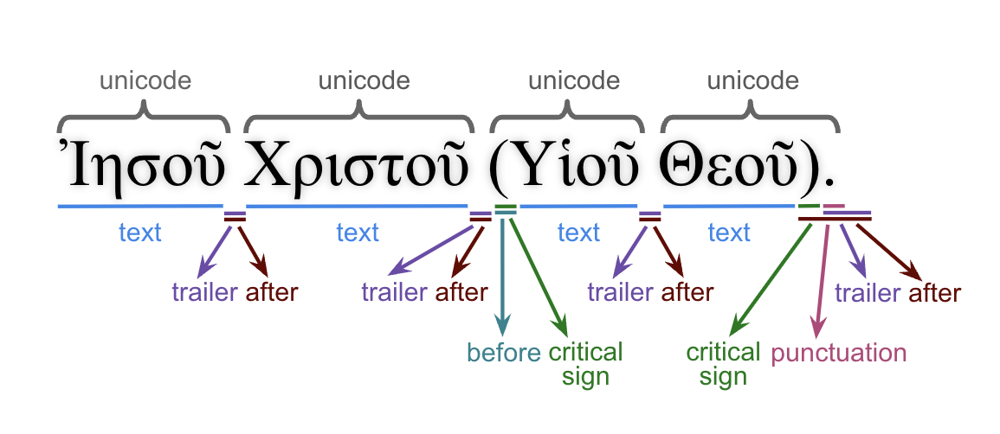

# N1904addons - Feature: betacode

Feature group |Feature type | Data type | Available for node types | Feature status
---  | --- | --- | --- | ---
[`Morpheus`](README.md#feature-group-morpheus-analyses-meta-and-summary) | `Node` | `str` | `word` | [✅](featurestatus.md#Trustworthy "Trustworthy")

## Feature description

The Greek unicode surface level word in Betacode. It is important to realize that this feature is **not** a transliteration of N1904-TF's [`unicode`](https://centerblc.github.io/N1904/features/unicode.html). The feature can be rather considered a translateration of the [`text`](https://centerblc.github.io/N1904/features/unicode.html) feature. The following image shows the relation between the various lexographic features in the N1904-TF dataset. 

For instance, where feature `unicode` would contain 'Ἀβραάμ.' in our conversion to `betacode` we will map it to '*)abraa/m', so without transliterating the trailing period.  

Betacode is used in specific applications like [Morpheus morphological tagging](https://github.com/perseids-tools/morpheus).

## See also

- [Beta Code encoding](https://stephanus.tlg.uci.edu/encoding.php).
- [Python library for handling Betacode (beta-code-py)](https://github.com/perseids-tools/beta-code-py).

## Data source

 - [Github repository](https://tonyjurg.github.io/create_TF_feature_betacode/)
