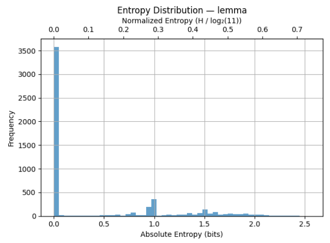

# N1904addons - Feature: lemma_entr_mbit

Feature group | Feature type | Data type | Available for node types | Feature status
---  | --- | --- | --- | ---
[`statistic`](README.md#feature-group-statistic) | `Node` |`int` | `word` | [✅](featurestatus.md#Trustworthy "Trustworthy")

## Feature short description

Normalized Shannon entropy of the distribution of parent phrase function (like Subject, Object, etc.) for each lemma.

## Feature values

A number *stored as an integer* representing the entropy in mili-bits.

In the N1904-TF dataset, the actual value ranges from 0 to 2550.

## Feature detailed description

<p>In practical terms, entropy reflects how predictable an element’s syntactic behavior is predictable. This feature expresses how consistently a given lemma (as stored in the <a href="https://centerblc.github.io/N1904/features/lemma.html"><code>lemma</code></a> feature) maps to a particular phrase function.</p>
<p>In this context these phrase functions are derived from feature <a href="https://centerblc.github.io/N1904/features/function.html"><code>function</code></a> and expanded with several additional categories (to view all details expand the item below).</p>

<details style="border: 1px solid lightgray; background-color: #f9f9f9; padding: 10px; border-radius: 5px;">
<summary title="Click to hide/unhide"><b>Parent phrase function details</b></summary>
<br>
<p>In the N1904-TF dataset, not all words belong to phrases with well-defined syntactic functions such as Subject or Object. For instance, conjunctions like δὲ or καὶ typically do not form part of syntactic phrases in the strict sense.</p>
<p>To ensure that every word can still be assigned a functional label, the following <a href="https://github.com/tonyjurg/Create-TF-entropy-features/blob/main/common.py">Python script</a> was developed. This script prioritizes assigning the canonical phrase function where available, but also supplements gaps with a set of extended categories.</p>
<p>The table below distinguishes between these two types of categories and shows the number of word nodes mapped to each one.</p>

<table border="1" cellpadding="5" cellspacing="0">
  <thead>
    <tr>
      <th>Source</th>
      <th>Value</th>
      <th>Description</th>
      <th>Frequency</th>
    </tr>
  </thead>
  <tbody>
    <tr>
      <td rowspan="6">From feature <code>function</code> (6 classes)</td>
      <td>Cmpl</td>
      <td>Complement</td>
      <td>35442</td>
    </tr>
    <tr>
      <td>Pred</td>
      <td>Predicate</td>
      <td>25138</td> 
    </tr>
    <tr>
      <td>Subj</td>
      <td>Subject</td>
      <td>21567</td>
    </tr>
    <tr>
      <td>Objc</td>
      <td>Object</td>
      <td>19371</td>
    </tr>
    <tr>
      <td>PreC</td>
      <td>Predicate-Complement</td>
      <td>9595</td>
    </tr>
    <tr>
      <td>Adv</td>
      <td>Adverbial</td>
      <td>5367</td>
    </tr>
    <tr>
      <td rowspan="6">Augmented pseudo classes (5 classes)</td>
      <td>Conj</td>
      <td>Conjunction</td>
      <td>16316</td>
    </tr>
    <tr>
      <td>Unkn</td>
      <td>Unknown</td>
      <td>2076</td>
    </tr>
    <tr>
      <td>Intj</td>
      <td>Interjection</td>
      <td>1470</td>
    </tr>
    <tr>
      <td>Aux</td>
      <td>Auxiliar</td>
      <td>1136</td>
    </tr>
    <tr>
      <td>Appo</td>
      <td>Apposition</td>
      <td>301</td>
    </tr>
  </tbody>
</table>

<p>The "Unkn" (unknown) category accounts for approximately 1.5% of all mappings, slightly raising both the absolute and normalized entropy.</p>
</details>
<br>
High entropy values indicate that a form is ambiguous, as it appears in multiple syntactic functions with similar probabilities. In contrast, low entropy values signify that a form is strongly associated with a single syntactic function, making it a reliable indicator of that role within the parent phrase.

<details style="border: 1px solid lightgray; background-color: #f9f9f9; padding: 10px; border-radius: 5px;">
<summary title="Click to hide/unhide"><b>Detailed mathematic description</b></summary>
<br>
<h3>Definition</h3>

<p>In information theory, <i>entropy</i> quantifies how unpredictable the outcome of a random variable is.  For a discrete variable \( X \) with possible outcomes \( x_1, x_2, ... x_n \) and corresponding probabilities \( p_1, p_2, ... p_n  \), the Shannon entropy is defined as:</p>

$$H(X) = -\sum_{i=1}^{n} p(i) \log_2 p(i)$$

<p>The logarithm base 2 expresses the result in bits.  By convention, the term \( p_i\,\log_2 p_i \) is taken to be zero when \( p_i=0 \), so that only outcomes with non‑zero probability contribute to the sum.</p>

<p>Entropy is maximised when all outcomes are equally likely (i.e., uniform distribution), and drops to zero when a single outcome has probability 1 and all others have probability 0 (i.e. when there is no uncertainty at all).</p>

<h3>Application</h3>

<p>In this Text-Fabric dataset the phrase function (the syntactic role of a word’s parent phrase) s treated as a discrete random variable \( F \). We examine how much information a given linguistic cue \( c \) (such as <a href="https://centerblc.github.io/N1904/features/text.html" target="_blank"><code>text</code></a> , <a href="https://centerblc.github.io/N1904/features/lemma.html" target="_blank"><code>lemma</code></a>, or <a href="https://centerblc.github.io/N1904/features/morph.html" target="_blank"><code>morph</code></a>) provides about the likely syntactic role of an occurrence of that cue.</p>

<p>For a specific cue \( c \), the empirical conditional distribution \( p(f \mid c) \) is calculated, which reflects how frequently the cue occurs with each phrase function \( f \) in the data. Based on this distribution, the conditional entropy can be calculated as:</p>

$$H(F \mid c) = -\sum_{f \in \mathcal{F}} p(f \mid c) \log_2 p(f \mid c)$$

<p>This quantity measures the uncertainty about the phrase function of a single occurrence of the cue \( c \), once the cue is known. It does <i>not</i> aggregate across different cues or sum over positions; rather, it characterizes how predictable the syntactic role is for <i>any individual instance</i> of the cue.</p>

<ul><li>A low value of \( H(F \mid c) \) indicates that the cue \( c \) strongly predicts a particular phrase function (e.g., it almost always functions as Subject).
</li><li>A high value indicates that the cue appears in multiple syntactic roles with similar probabilities, making its function hard to predict.
</li></ul>

<p>In the Text-Fabric features, these entropy values are multiplied by 1000 and rounded to the nearest integer (i.e., scaled to millibits) to avoid storing floating-point numbers, while preserving reasonable precision.</p>

</details>
<br>
The following table provides some statistic key metrics for this feature counted over the total of unique lemma of the absolute entropy:

```txt
=== lemma ===
Count:   5396
Min:     0000
25%ile:  0000
Median:  0000
75%ile:  0918
Max:     2550
Mean:    0423
StdDev:  0654
```

This indicates that most lemmas are highly predictable in terms of their syntactic roles, while a small subset show high entropy due to usage in multiple phrase functions.

The following plot illustrates both the absolute and normalized entropy distribution for all 5396 unique lemmas in the N1904-TF dataset:



## Theoretical example

To better understand the significance of entropy values, the following plot illustrates the absolute entropy associated with several synthetic probability distributions. 


The information can also be presented in a table augmented with the values for normalized entropy. In the example above, we assumed a total of 8 possible classes. Therefore, to compute the normalized entropy, we can simply divide each absolute entropy by 3, since \\( \log_2(8) \\) = 3.

Distribution | Absolute entropy (bits) | Normalized entropy (8 classes)
--|---|--
Uniform (2 outcomes) | 1.0000 | 0,3333
Skewed (0.9, 0.1) | 0.4689 | 0.1563
Heavy skewed (0.99, 0.01) | 0.0808 | 0.1563
Moderate skewed (0.7, 0.3) | 0.8813 | 0.2938
Uniform (4 outcomes) | 2.0000 | 0.667
Uniform (8 outcomes) | 3.0000 | 1.0000
Mixed (0.6, 0.2, 0.1, 0.1) | ~1.6855 | ~0.5618

This highlight the following key properties of entropy:
- Entropy increases with the number of equally likely outcomes.
- Entropy decreases when one outcome dominates the distribution.

## See also

Related features:
 - [morph_entr](morph_entr.md): Absolute entropy of a morph(-tag of a word) as predictor of its parent phrase function (in bits).
 - [text_entr](text_entr.md): Absolute entropy of a surface level wordform as predictor of its parent phrase function (in bits).
 - [morph_entr_norm](morph_entr_norm.md): Normalized entropy of a morph(-tag of a word) as predictor of its parent phrase function (range 0 to 1).
 - [lemma_entr_norm](lemma_entr_norm.md): Normalized entropy of the lemma (of this word) as predictor of its parent phrase function (range 0 to 1).
 - [text_entr_norm](text_entr_norm.md): Normalized entropy of a surface level wordform as predictor of its parent phrase function (range 0 to 1).

## References

- Shannon, C. E. ["A Mathematical Theory of Communication"](https://people.math.harvard.edu/~ctm/home/text/others/shannon/entropy/entropy.pdf) in *Bell System Technical Journal*, Vol. 27, pp. 379–423, 623–656, July, October, 1948.
- Manning, C. D., Schütze, H. [*Foundations of Statistical Natural Language Processing*](https://nlp.stanford.edu/fsnlp/) (Cambridge, MA: MIT Press, 1999), esp. page 61 and further.

## Data source

GitHub repository [Create-TF-entropy-features](https://tonyjurg.github.io/Create-TF-entropy-features/).

