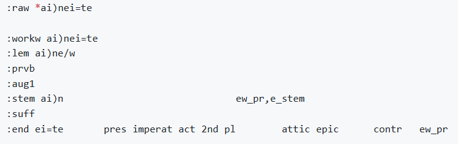

# N1904addons feature: md{num}_ending_uc

Feature group |Feature type | Data type | Available for node types
---  | --- | --- | ---
`Morpheus` | `Node`|`str`|`word`

## Feature description

Detailed feature for individual Morpheus analysis block #{num} providing details on the ending in unicode.

This is a Morpheus Details (md) feature.

The following image shows an example of a Morpheus analyses block.

