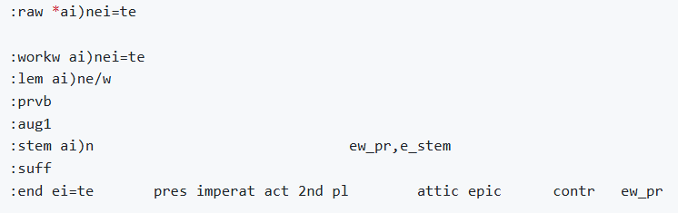

# N1904addons - Feature: mm_raw_bc

Feature group |Feature type | Data type | Available for node types | Feature status
---  | --- | --- | --- | ---
[`Morpheus`](README.md#feature-group-morpheus-analyses-meta-and-summary) | `Node` | `str` | `word` | [✅](featurestatus.md#Trustworthy "Trustworthy")

## Feature description

The raw form of the word in `unicode, as it was input to the Morpheus analysis.

This is a Morpheus meta data feature ([more info](../using_the_morpheus_features.md)).

## Feature values

Either:
 - When at least one Morpheus analytic block was returned for this word node, this feature contains the betacode representation of the raw: field of the analytic block. 
 - When no analytic block was returned, this feature contains no data (which is the case for 2124 word nodes).

## Notes

In most cases where this feature contains data, it matches feature [`betacode`](betacode.md), except for 32 instances where an capitalized word did not receive any Morpheus analytic block. In those cases, the word was decapitalized and the analysis re-runned. For example, the `*a*g*n*w*s*t*w` (ΑΓΝΩΣΤΩ in [Acts 17:23](https://learner.bible/text/show_text/nestle1904/Acts/17/23)) was changed to `a)gnwstw`, which did result in a succesfull analysis.
 
Note that this feature may also include ellipsis (indicated with '). [Crane provides as example ἐπέμπετ᾽](https://github.com/gregorycrane/Homerica/blob/1ad202eec627414e7153f5512d6cb43abc22e308/Tb%2BMorpheus#L77), which could stand for ἐπέμπετε ("you [pl] were sending") or ἐπέμπετο ("s/he was being sent").

The following image shows an example of a Morpheus analyses block.

## Data source
