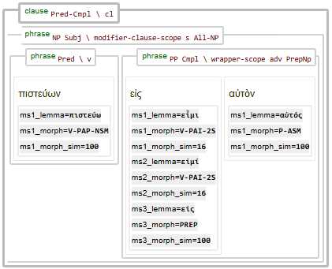

# N1904addons - Feature: ms{ind}_morph_sim

Feature group |Feature type | Data type | Available for node types | Feature status 
---  | --- | --- | --- | ---
[`Morpheus`](README.md#feature-group-morpheus-analyses-meta-and-summary) | `Node` | `str` | `word` | [🆗](featurestatus.md#Reasonable "Reasonable")

## Feature description

Summary feature for grouped analysis #{ind} providing a *list* of morps similairties to the N1904-TF morph

This is a Morpheus [summary data feature](../using_the_morpheus_features.md#morpheus-feature-classes).

## Feature values

A string of morphological tags separated by slashes. 

For example `ms2_morph_sim` = `100/96/81`

## Coding

The following Python code demonstrates how to programaticaly obtain details like lemma and morphological tags per grouped analysis blocks.

```Python
wordNodes = F.otype.s("word")
for wordNode in wordNodes:
    for blockNumber in range(1, 9):
        # dynamically get F.ms{blockNumber}_lemma & morph
        lemma = Fs(f"ms{blockNumber}_lemma").v(wordNode)
        if not lemma: continue
        morph_string = Fs(f"ms{blockNumber}_morph").v(wordNode)
        morph_sim_string = Fs(f"ms{blockNumber}_morph_sim").v(wordNode)
        # decompose on the slash
        parts = morph_string.split("/")
        # print what was found
        print(f"node={wordNode}, number={blockNumber} → lemma={lemma}, tags: {parts}")

node=1, number=1 → lemma=Βίβλος, tags: ['N-NSM']
node=1, number=2 → lemma=βίβλος, tags: ['N-NSF']
node=2, number=1 → lemma=γένεσις, tags: ['N-GSF']
node=3, number=1 → lemma=Ἰησοῦς, tags: ['N-GSM', 'N-VSM', 'N-PRI']
...
```

The snippet below dynamicaly builds a list of names of 'numbered' Morpheus 
feature names. This allows to easily pass this list as an option to `A.show()`.

```python
# Dynamically generate feature names for all morphology sets
morphFeatureList = (
    [f'ms{ind}_lemma'      for ind in range(1, 9)]
  + [f'ms{ind}_morph'      for ind in range(1, 9)]
  + [f'ms{ind}_morph_sim'  for ind in range(1, 9)]
)
# Display the query results with the Morpheus features
A.show(QueryResult, extraFeatures=morphFeatureList)
```

The image below shows a syntax tree with the display of these features enabled.



## Morpheus analytic blocks

The following image shows an example of a Morpheus analyses block.


## Data source

GitHub repository [Create_morpheus_TF_dataset](https://tonyjurg.github.io/Create_morpheus_TF_dataset/).
