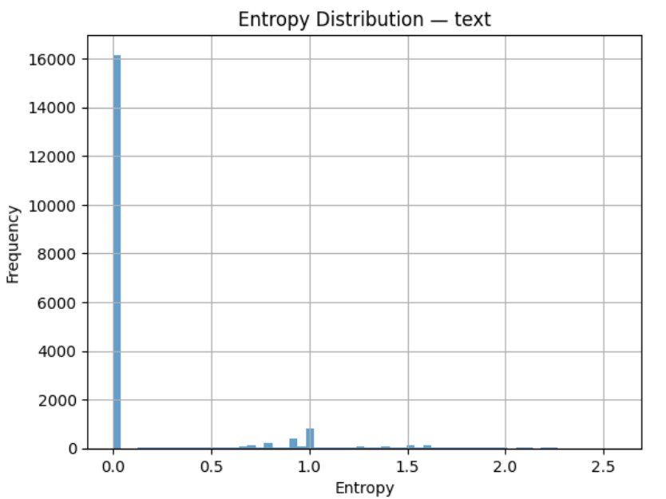

# N1904addons feature: lemma_entr

Feature group | Feature type | Data type | Available for node types
---  | --- | --- | ---
`statistic`|`Node`|`String`|`word`

## Feature description

Entropy of a surface level wordform (feature[`text`](https://centerblc.github.io/N1904/features/text.html)) as predictor of its parent phrase function

In our syntactic annotated Text-Fabric dataset, we define entropy as a measure of the uncertainty or variability of how an element (here: surface level wordform; text) predicts or aligns with the syntactic functions (like Subject, Object, etc.) of the phrase it belongs to.

## Feature values

In this dataset, the feature values range from 0 to 2.5651 (note: the dot denotes a decimal point, not a thousands separator).

Entropy reflects the extent to which such an element's (here: text) syntactic behavior is predictable. High entropy values indicate that a form is ambiguous, as it appears in multiple syntactic functions with similar probabilities. In contrast, low entropy values signify that a form is strongly associated with a single syntactic function, making it a reliable indicator of that role within the parent phrase.

The following table provides some statistic key metrics for this feature counted over the total of unique morphs:

```text
=== text ===
Count:   19446
Min:     0.0000
25%ile:  0.0000
Median:  0.0000
75%ile:  0.0000
Max:     2.5651
Mean:    0.1843
StdDev:  0.4431
```

The following plot provides a graphical presentation of the entropy distribution for all 19446 unique surface level wordforms (feature[`text`](https://centerblc.github.io/N1904/features/text.html)) in the N1904-TF dataset:



## See also

Related features:
 - [morph_entr](morph_entr.md): Entropy of a morph(-tag of a word) as predictor of its parent phrase function
 - [lemma_entr](lemma_entr.md): Entropy of the lemma (of a word) as predictor of its parent phrase function

Descriptive document:
 - [About entropy an N1904-TF](../entropy_feature.md).

## Source

[Github repository](https://github.com/tonyjurg/Create-TF-entropy-features).

