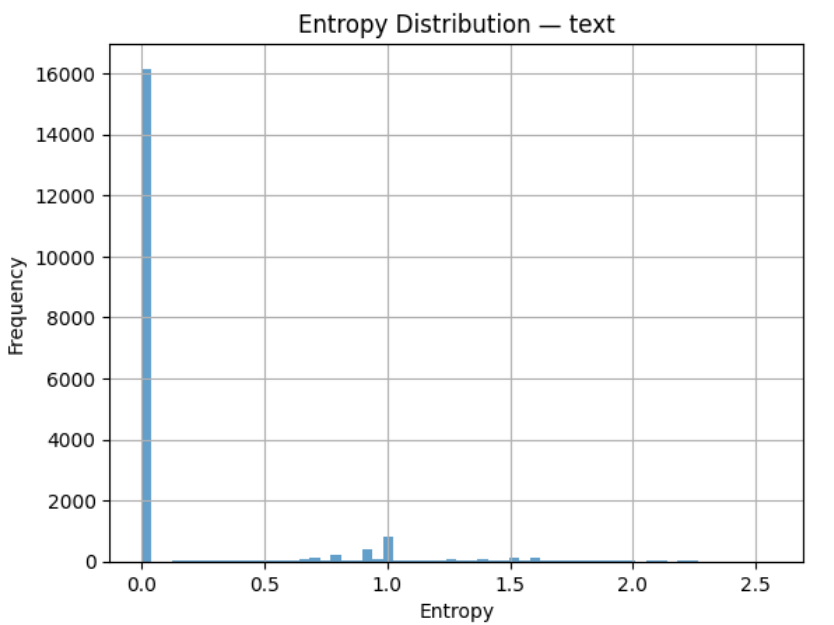
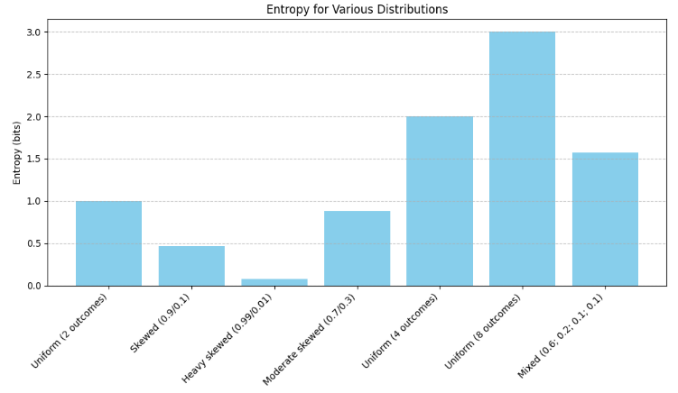

# N1904addons - Feature: text_entr_mbit

Feature group | Feature type | Data type | Available for node types | Feature status
---  | --- | --- | --- | ---
[`statistic`](README.md#feature-group-statistic) | `Node` |`int` | `word` | [✅](featurestatus.md#Trustworthy "Trustworthy")

## Feature short description

Absolute entropy of a surface level wordform (feature[`text`](https://centerblc.github.io/N1904/features/text.html)) as predictor of its parent phrase function (like Subject, Object, etc.).

## Feature values

A number *stored as integer* representing the entropy in mili-bits.

In the N1904-TF dataset, the actual value ranges from 0 to 2584.

## Feature detailed description

<p>In practical terms, entropy reflects how predictable an element’s syntactic behavior is predictable. This feature expresses how consistently a given surface level word (as stored in the <a href="https://centerblc.github.io/N1904/features/text.html"><code>text</code></a> feature) maps to a particular phrase function.</p>
<p>In this context these phrase functions are derived from feature <a href="https://centerblc.github.io/N1904/features/function.html"><code>function</code></a> and expanded with several additional categories (to view all details expand the item below).</p>

<details style="border: 1px solid lightgray; background-color: #f9f9f9; padding: 10px; border-radius: 5px;">
<summary title="Click to hide/unhide"><b>Parent phrase function details</b></summary>
<br>
<p>In the N1904-TF dataset, not all words belong to phrases with well-defined syntactic functions such as Subject or Object. For instance, conjunctions like δὲ or καὶ typically do not form part of syntactic phrases in the strict sense.</p>
<p>To ensure that every word can still be assigned a functional label, the following <a href="https://github.com/tonyjurg/Create-TF-entropy-features/blob/main/common.py">Python script</a> was developed. This script prioritizes assigning the canonical phrase function where available, but also supplements gaps with a set of extended categories.</p>
<p>The table below distinguishes between these two types of categories and shows the number of word nodes mapped to each one.</p>

<table border="1" cellpadding="5" cellspacing="0">
  <thead>
    <tr>
      <th>Source</th>
      <th>Value</th>
      <th>Description</th>
      <th>Frequency</th>
    </tr>
  </thead>
  <tbody>
    <tr>
      <td rowspan="6">From feature <code>function</code> (6 classes)</td>
      <td>Cmpl</td>
      <td>Complement</td>
      <td>35442</td>
    </tr>
    <tr>
      <td>Pred</td>
      <td>Predicate</td>
      <td>25138</td> 
    </tr>
    <tr>
      <td>Subj</td>
      <td>Subject</td>
      <td>21567</td>
    </tr>
    <tr>
      <td>Objc</td>
      <td>Object</td>
      <td>19371</td>
    </tr>
    <tr>
      <td>PreC</td>
      <td>Predicate-Complement</td>
      <td>9595</td>
    </tr>
    <tr>
      <td>Adv</td>
      <td>Adverbial</td>
      <td>5367</td>
    </tr>
    <tr>
      <td rowspan="6">Augmented pseudo classes (5 classes)</td>
      <td>Conj</td>
      <td>Conjunction</td>
      <td>16316</td>
    </tr>
    <tr>
      <td>Unkn</td>
      <td>Unknown</td>
      <td>2076</td>
    </tr>
    <tr>
      <td>Intj</td>
      <td>Interjection</td>
      <td>1470</td>
    </tr>
    <tr>
      <td>Aux</td>
      <td>Auxiliar</td>
      <td>1136</td>
    </tr>
    <tr>
      <td>Appo</td>
      <td>Apposition</td>
      <td>301</td>
    </tr>
  </tbody>
</table>

 The "Unkn" (unknown) category accounts for approximately 1.5% of all mappings, slightly raising both the absolute and normalized entropy.
</details>
<br>
High entropy values indicate that a form is ambiguous, as it appears in multiple syntactic functions with similar probabilities. In contrast, low entropy values signify that a form is strongly associated with a single syntactic function, making it a reliable indicator of that role within the parent phrase.

<details style="border: 1px solid lightgray; background-color: #f9f9f9; padding: 10px; border-radius: 5px;">
<summary title="Click to hide/unhide"><b>Detailed mathematic description</b></summary>
<br>
<h3>Definition</h3>
<p>Entropy is a measure from information theory that quantifies uncertainty or unpredictability in a probability distribution. It is defined as:</p>

$$H(X) = -\sum_i P(x_i) \log_2 P(x_i)$$

<p>Where:</p>
<ul>
  <li>The part \( P(x_i) \) is the probability of the \( i-th \) outcome.</li>
  <li>The part \( log_2 \) ensures the result is expressed in bits.</li>
  <li>It is assumed in this context that \( log_2(0)=0 \).</li>
</ul>
<p>Entropy measures the uncertainty associated with a probability distribution. It reaches its maximum when all outcomes are equally likely (i.e., maximum uncertainty), and its minimum (zero) when one outcome is certain.</p>
<h3>Application</h3>
<p>In the context of the N1904-FT dataset, we apply this principle to estimate the uncertainty of syntactic function prediction based on linguistic features.</p>
<p>Let an element \(e \in D \), where \( D = \{ \text{lemma}, \text{morph}, \text{text} \} \), represent a linguistic feature. If this element is associated with \( n \) different phrase functions \( f \), then the entropy \( H(e \mid f) \) in bits is calculated as:</p>

$$H(e|f) = -\sum_{i=1}^{n} p_i \log_2(p_i)$$

<p>where \( p_i \) is the probability that element \( e \) corresponds to the \( i-th \) function.</p>
<p>If the distribution is uniform (i.e., all \( p_i = \frac{1}{n} \) ), the entropy reaches its maximum:</p>

$$H(e|f) = -n \cdot \frac{1}{n} \cdot \log_2\left(\frac{1}{n}\right) = \log_2(n)$$

<p>In the mapping used for calculating this feature, there are \( n = 11 \) phrase function categories. Thus, the theoretical maximum entropy for a given datatype \( D \) is:</p>

$$H_{\text{max}}(D) = \log_2(11) \approx 3.459 \text{ bits}$$

<p>This value represents the upper bound of uncertainty when a linguistic feature provides no predictive information about phrase function.</p>

<p>To obtain a normalized entropy, where values for \( H(e|f) \) are in the range 0 to 1 (inclusive), the following formula can be applied for each datatype \( D \):</p>

$$H_{\text{norm}}(D) = \frac{H(D)}{H_{\text{max}}(D)}$$

</details>
<br>
The following table provides some statistic key metrics for the absolute entropy for the total of unique text token (surface level word forms) in  N1904-TF:

```text
=== text ===
Count:   19446
Min:     0000
25%ile:  0000
Median:  0000
75%ile:  0000
Max:     2584
Mean:    0150
StdDev:  0393
```

This indicates that most text elements are highly predictable in terms of their syntactic roles, while a small subset show high entropy due to usage in multiple phrase functions.

The following plot illustrates both the absolute and normalized entropy distribution for all 19446 unique surface level word forms in the N1904-TF dataset):



## Theoretical example

To better understand the significance of entropy values, the following plot illustrates the absolute entropy associated with several synthetic probability distributions. 



The information can also be presented in a table augmented with the values for normalized entropy. In the example above, we assumed a total of 8 possible classes. Therefore, to compute the normalized entropy, we can simply divide each absolute entropy by 3, since since \\( \log_2(8) \\) = 3.

Distribution | Absolute entropy (bits) | Normalized entropy (8 classes)
--|---|--
Uniform (2 outcomes) | 1.0000 | 0,3333
Skewed (0.9, 0.1) | 0.4689 | 0.1563
Heavy skewed (0.99, 0.01) | 0.0808 | 0.1563
Moderate skewed (0.7, 0.3) | 0.8813 | 0.2938
Uniform (4 outcomes) | 2.0000 | 0.667
Uniform (8 outcomes) | 3.0000 | 1.0000
Mixed (0.6, 0.2, 0.1, 0.1) | ~1.6855 | ~0.5618

This highlight the following key properties of entropy:
- Entropy increases with the number of equally likely outcomes.
- Entropy decreases when one outcome dominates the distribution.

## See also

Related features:
 - [morph_entr](morph_entr.md): Absolute entropy of a morph(-tag of a word) as predictor of its parent phrase function (in bits).
 - [lemma_entr](lemma_entr.md): Absolute entropy of the lemma (of this word) as predictor of its parent phrase function (in bits)
 - [morph_entr_norm](morph_entr_norm.md): Normalized entropy of a morph(-tag of a word) as predictor of its parent phrase function (range 0 to 1).
 - [lemma_entr_norm](lemma_entr_norm.md): 'Normalized entropy of the lemma (of this word) as predictor of its parent phrase function (range 0 to 1).
 - [text_entr_norm](text_entr_norm.md): Normalized entropy of a surface level wordform as predictor of its parent phrase function (range 0 to 1).

## References

- Shannon, C. E. ["A Mathematical Theory of Communication"](https://people.math.harvard.edu/~ctm/home/text/others/shannon/entropy/entropy.pdf) in *Bell System Technical Journal*, Vol. 27, pp. 379–423, 623–656, July, October, 1948.
- Manning, C. D., Schütze, H. [*Foundations of Statistical Natural Language Processing*](https://nlp.stanford.edu/fsnlp/) (Cambridge, MA: MIT Press, 1999), esp. page 61 and further.
 
## Data source

GitHub repository [Create-TF-entropy-features](https://tonyjurg.github.io/Create-TF-entropy-features/).

