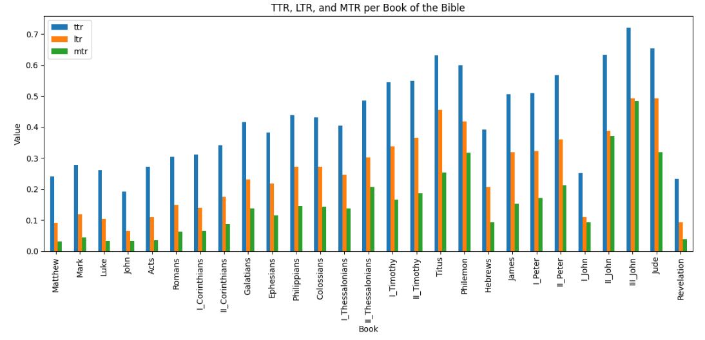

# N1904addons - Feature: text_ttr

Feature group | Feature type | Data type | Available for node types | Feature status
---  | --- | --- | --- | ---
[`statistic`](README.md#feature-group-statistic) | `Node` |`str` |  `book` `chapter` `verse` `sentence` `group` `wg` `phrase` `subphrase` `clause` | [✅](featurestatus.md#Trustworthy "Trustworthy")

## Feature short description

Type to Token Ratio based on wordform (text) for all word nodes under this node.

## Feature values

A float number *stored as a string* representing a ratio in the range 0 to 1 (inclusive) where the dot denotes a decimal point, not a thousands separator.

## Detailed feature description

This feature provides the Text-to-Token Ratio (TTR), which is a measure for wordform diversity. It is defined as:

$$
  \text{TTR} 
    = \frac{|\{\text{unique wordforms in the text}\}|}{N}
$$

In this calculation all wordformss are first changed to lower case.

## Visualizing

The following plot compares the Type-to-Token Ratios measured over word form (TTR), lemma (LTR), and morphology (MTR) for each book of the New Testament. The immage clearly shows that shorter books generaly are resulting in higher ratio, even though TTR is iself already a ratio. There are various methods of normalization which are made available on Python in a conveniant package [lexicalrichness](https://lexicalrichness.readthedocs.io/en/latest/#)

## See also

Related features:

  - [morph_ttr](morph_ttr.md): Type to Token Ratio based on morph-tags for all word nodes under this node.
  - [lemma_ttr](lemma_ttr.md): Type to Token Ratio based on lemma for all word nodes under this node.

## Data source

The production notebook can be found on [this repository](https://tonyjurg.github.io/Create-TF-stat-features/).
